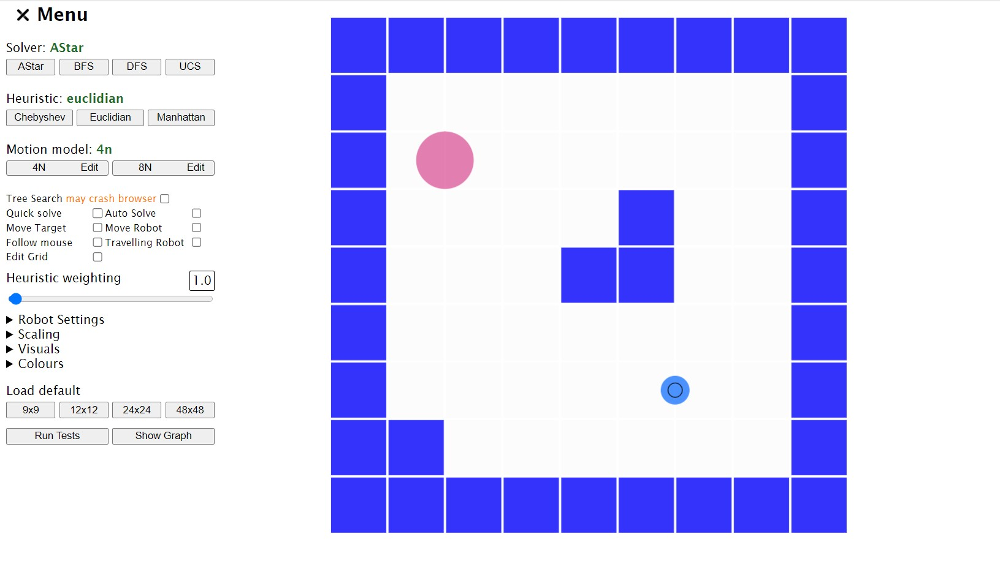
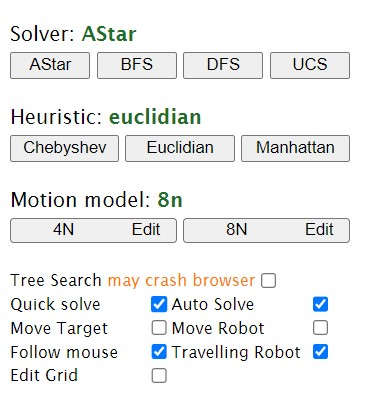
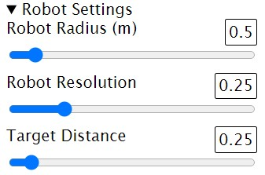

# Robot solver

To run the program, open it in Visual Studio Code and run live server.  Alternatively, open index.html in your favourite browser.

## Solver

When you select a solver the simulation will try to find a path to the destination marked in blue, and show a map of the solution.

## Heuristic

This only affects A Star.  The selected heuristic will be displayed on clicking any option.

## Motion model

Default is 4n. The motion models can be edited by clicking edit. Each must be edited seperately

## Additional options

Many of the additional options work in conjunction with each other to change the visualisation or intractivity of the simulation.

### Tree search

This can crash the browser if selected, particularly with BFS and DFS algorithms.

### Quick solve

Will not show an animated solver, just the solution.

### Auto solve

Attempt to solve the grid every time you click the mouse button or make any changes.

### Move Target/Robot

Move each to a new spot on the grid.  Each will move independently of the grid space and resolution.
In practice, this means that not all spot have a solution, depending on various factors, such as resolution and robot radius. if Auto solve is also checked, the simulation will find a path whenever you drop the target or robot.

### Follow mouse

The target will move with the mouse position on the grid. if Auto solve is also checked, the simulation will interactively find a path as you move the mouse. If you also select quick solve, the animation is also skipped, finding a solution and displaying it as quickly as possible.

### Travelling Robot

Robot will move to the current destination when the solution is found. If checked when Auto solve, quick solve and follow mouse are checked, the robot will chase the target as you move the mouse.

### Edit grid

Left click to add a cell and right click to remove a cell.

## Heuristic weighting

From 0 to 100.  This only affects the A Star search. And has different impacts depending on the selected heuristic.

## Robot settings

Opening this menu reveals three sliders to change the robot radius, resolution, and distance to target.  Distance to target sets an increasingly large target radius to the robot, so it can find a solution at a lower resolution.

## Scaling

This changes the visual scale of grid and some of the dots, including the grid scanner, visited and neighbour node.

## Visuals

This determines what can be see in the visualiser.
*note: Highlight boundaries reflects the boundaries found at the given resolutions, so does not always look accurate*
*note: If you uncheck Show solution, the robot will not travel the path.*  All other aspects of the path visualisation can be switched off.
If you turn on Show scan dots, it can slow down the simulation as it is an active scan of the grid at a given resolution.

## Colours

This is a key of all the colours used in the simulation.

## Load default

There are 4 available defaults from 9x9 to 48x48. More can be added in the MapConfig folder.  Follow the same pattern with respect to numbering: i.e, config**9**x**9**.json and map**9**x**9**.xlsx. Even if the the grid is not a perfect square, just use one number for both width and height. Then  copy and paste one of the buttons from line 321 in index.html, changing the value in data-id to the same value chosen for the width/height in the filenames. You can relabel it if you wish.

## Run Tests

This executes a barrage of tests on the current configuration, at various resolutions, motion models and heuristics.

## Show Graph

Shows a graph of test results. Will not work if there are no results available.
